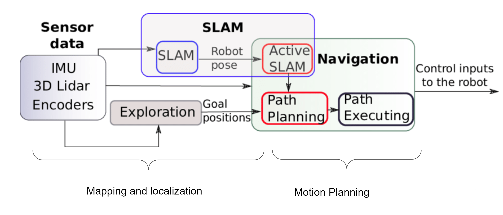

<em>
We present Active SLAM in the Wild that focuses on using combination of SLAM and Motion planning methods to make an agent take decisons based on the changing environment.
</em>

<a href="https://github.com/zhluk/Active-SLAM-in-the-Wild" class="btn">Code</a>
<!-- <a href="https://arxiv.org/abs/2112.03221" class="btn">Paper</a> -->

* * *

## Abstract

This paper presents a Right-Invariant EKF-based Active Simultaneous Localization and Mapping (SLAM) framework for a robot to explore a 2D environment with the goal of achieving low SLAM uncertainty while maximizing area coverage. Two motion planning methods are proposed to solve the active SLAM problem: a covariance-based greedy approach and a novel Quadratic Programming (QP)-based approach. The greedy model is a one-step look-ahead method, which moves in the direction of the lowest uncertainty in the robot’s pose and explores the map through a finite state machine. The QP-based approach drives the robot towards dynamically set goal points. Both methods are implemented on the well-known 2D Victoria Park dataset and localization is performed in relation to the landmarks (trees). Tuning hyper-parameters in the greedy-based approach allows it to make satisfactory area coverage at a high computational cost while the QP motion planning model sacrifices the area coverage for lower runtime. Our method does not make definitive improvements on current methods but features promising results.

## Overview
 We start from an initial state and get a continuous stream of landmark data from the LiDAR sensor. This sensor data is fed into the active SLAM algorithm which first estimates robot pose and then uses the motion planning algorithm to actively estimate the next control inputs. For this project we have used RIEKF as the SLAM method and two different methods for motion planning, a covariance based greedy method and a Quadratic programming  based approach

<em>Overall block diagram showing our approach..</em>

## Dataset
We have used the Victoria Park dataset to test our hypothesis on the suggest Active SLAM strategy in the paper. The Victoria Park dataset was captured using a car mounted Laser scanner. The dataset is available [here](http://www-personal.acfr.usyd.edu.au/nebot/victoria_park.htm)
## Outputs on Covariance-based greedy approach

## Outputs on QP-based approach

## Future work
